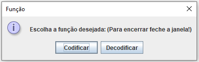
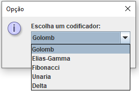

<h1>Trabalho do Grau A de Teoria da Informação - Unisinos</h1>

<h3>Membros do Grupo:</h3>

👩‍🎓 Karolina Pacheco

👩‍🎓 Nadine Schneider

👨‍🎓 Tiago Costa

👨‍🎓 Rafael Stefani Baptista

### HOW TO RUN

Para rodar a implementação feita pelo grupo, basta rodar a classe **Main**. 

A partir dai, um menu aparecerá na tela, como abaixo:

Ao selecionar a opção **Codificar** será necessário informar qual o arquivo a ser codificado, podendo ser o arquivo sum, alice.txt ou outro. 

Após selecionar o arquivo, é necessário selecionar qual o método de codificação. Para isso, basta fazer a seleção pelo menu, como abaixo: 

Caso seja selecionado a codificação Golomb, então deve-se ainda entrar o valor de divisor a ser utilizado.

Depois de entradas todas as informações, a codificação é feita, gerando um arquivo .cod.

Se for selecionada a opção **Decodificar**, então só poderão ser selecionados arquivos .cod. 

Após a seleção do arquivo, é iniciada a decodificação, que é feita a partir da leitura do cabeçalho para descobrir qual método de codificação foi utilizada, e assim utilizar o seu correspondente para decodificação.

Ao final da decodificação um arquivo .dec é gerado.

### Informações da Implementação

As codificações e decodificações implementadas foram: Unária, Elias-Gamma, Golomb e Fibonacci. Todas foram implementadas pelo grupo, não foram utilizadas bibliotecas.

Alguns códigos auxiliares foram utilizados, como o cálculo de log na base 2 de um número, para a codificação Golomb. A referência para o código utilizado pode ser encontrada ao final deste Readme.

O código tem a seguinte estrutura:

- Uma interface Encoder, que define o contrato que todas as codificações seguem para realizar a codificação.
- Uma interface Decoder, que define o contrato que todas as codificações seguem para realizar a decodificação.

O grupo utilizou para a maioria das decodificações (exceto fibonacci, onde foi utilizado somente bitwise) o [BitSet](https://docs.oracle.com/javase/7/docs/api/java/util/BitSet.html), que é uma estrutura do Java para acesso a bits, o que facilita para verificação de onde encontra-se o delimitador da codificação.

Para a codificação/decodificação Fibonacci, utilizou-se o valor ascii 235 para representar o valor 0, visto que a codificação Fibonacci não faz diretamente a codificação deste valor.

Foi escolhido o valor ascii 235 pois este é o valor que, observando na ánalise de frequencia disponibilizada dos arquivos sum e alice.txt, não aparece em nenhum dos arquivos. Dessa forma, nenhum dos outros valores é impactado.

O grupo não implementou nenhuma forma de dicionário no trabalho.

<h3>Objetivo do T1:</h3>

Elaborar uma solução computacional que codifique (compacte) e decodifique (descompacte) arquivos. Para isto deve ser implementado um protótipo que deve ser testado com a compactação e descompactação dos arquivos 📄alice29.txt e 📄sum do corpus de Canterbury (corpus.canterbury.ac.nz/descriptions/#cantrbry).
  
A meta é desenvolver uma solução de compactação (sem perda – lossless) empregando as abordagens de codificação a nível de símbolo. 

As formas de codificação que devem ser suportadas são: 📘Golomb, 📗Elias-Gamma, 📕Fibonacci, 📒Unária e 📙Delta. O usuário deve poder escolher o tipo de compactação que será empregado, bem como o arquivo a ser codificado/decodificado.

A estrutura do processo é a seguinte: a partir da leitura do arquivo original, o encoder gera o arquivo codificado (compactado); o decoder pode então ler o arquivo codificado e gerar um arquivo decodificado, que deve ser exatamente igual ao arquivo original.

No arquivo compactado, os dois primeiros bytes formam um cabeçalho, armazenando meta informação sobre como o arquivo foi codificado: o primeiro byte indica o tipo de codificação (0: Golomb, 1:Elias-Gamma, 2:Fibonacci, 3:Unária e 4:Delta) e o segundo byte irá possuir o valor do divisor caso tenha sido usada a codificação Golomb (caso contrário o valor do segundo byte é zero); consequentemente os codewords resultantes do processo de codificação são armazenados no arquivo a partir do terceiro byte.

<h4>Observações:</h4>

• A leitura e gravação dos arquivos pode ser realizada byte a byte.

• O processo de geração do arquivo compactado pode implicar no uso de um buffer de saída onde os codewords (resultantes da codificação do arquivo) irão sendo inseridos um a um, empregando-se para isto operações bit a bit (bitwise ops). Finalmente, o conteúdo do buffer de saída é então gravado em um arquivo.

• O encoder e o decoder podem ser na realidade o mesmo programa, sendo somente parametrizado de forma distinta para cada caso (um parâmetro pode ser o modo de operação: codificar ou decodificar).

<h4>Referências</h4>

Bitwise Java - https://www.geeksforgeeks.org/bitwise-operators-in-java/

Java unsigned bytes - https://www.dei.isep.ipp.pt/~asc/tiny-papers/java-unsigned-bytes.pdf

Log base 2 java - https://www.techiedelight.com/calculate-log-base-2-in-java/

